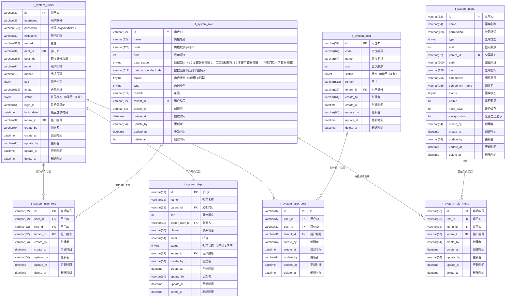

# 通用后台管理系统 - 设计文档

## 1. 系统架构设计

### 1.1 整体架构


### 1.2 RBAC权限模型（基于现有数据库表结构）



**注意事项：**
- 数据库表结构完全基于现有的 `sql/mysql.sql` 文件
- 用户表字段名为 `username` 而非 `account`
- 所有表都包含完整的审计字段（创建者、创建时间、更新者、更新时间、删除时间）
- 支持多租户架构（tenant_id字段）
- 角色表的 `delete_at` 字段类型为 `bit`，其他表为 `datetime`

### 1.3 密码安全设计

**使用现有的 `pkg/util/pswd` 密码算法**

- **算法**: Argon2id (industry standard)
- **参数配置**:
  - Memory: 64MB
  - Iterations: 3
  - Parallelism: 4
  - Salt Length: 16 bytes
  - Key Length: 32 bytes
- **存储格式**: `$argon2id$v=19$m=65536,t=3,p=4$<salt>$<hash>`

**密码处理流程**:
```go
// 密码加密（用户注册/修改密码时）
hashedPassword, err := pswd.HashPassword(plainPassword)

// 密码验证（用户登录时）
isValid, err := pswd.VerifyPassword(plainPassword, storedHashedPassword)
```

## 2. 模块设计方案

### 2.1 需要新增的模块

#### 2.1.1 认证服务模块（优先级：高）

**文件结构：**
```
api/proto/admin/v1/auth.proto              # 认证接口定义
app/admin/internal/service/auth/            # 认证服务层
app/admin/internal/biz/auth/               # 认证业务层
```

**核心功能：**
- 用户登录验证（使用 `pswd.VerifyPassword`）
- JWT token生成和管理
- 密码修改（使用 `pswd.HashPassword`）
- 用户信息获取

**登录验证流程：**
```go
// 1. 根据用户名查找用户（注意：数据库字段为 username）
user, err := userRepo.FindByUsername(ctx, request.Username)

// 2. 验证密码
isValid, err := pswd.VerifyPassword(request.Password, user.Password)

// 3. 生成JWT Token
token, err := jwt.GenerateToken(user.ID, user.Username)
```

#### 2.1.2 角色管理模块（优先级：高）

**文件结构：**
```
api/proto/admin/v1/system_role.proto       # 角色接口定义
app/admin/internal/service/systemrole/     # 角色服务层
app/admin/internal/biz/systemrole/        # 角色业务层
app/admin/internal/data/systemrole/       # 角色数据层
app/admin/internal/data/ent/schema/systemrole.go # Ent实体定义
```

**核心功能：**
- 角色CRUD操作
- 角色权限分配
- 数据权限配置
- 角色用户关联

#### 2.1.3 菜单权限模块（优先级：高）

**文件结构：**
```
api/proto/admin/v1/system_menu.proto       # 菜单接口定义
app/admin/internal/service/systemmenu/     # 菜单服务层
app/admin/internal/biz/systemmenu/        # 菜单业务层
app/admin/internal/data/systemmenu/       # 菜单数据层
```

**核心功能：**
- 菜单CRUD操作
- 菜单树结构管理
- 用户菜单权限查询

#### 2.1.4 权限校验中间件（优先级：高）

**文件结构：**
```
app/admin/internal/middleware/permission/   # 权限校验中间件
pkg/middleware/rbac/                       # RBAC权限验证组件
```

**核心功能：**
- 接口权限验证
- 数据权限过滤
- 权限缓存机制

#### 2.1.5 部门管理模块（优先级：中）

**文件结构：**
```
api/proto/admin/v1/system_dept.proto       # 部门接口定义
app/admin/internal/service/systemdept/     # 部门服务层
app/admin/internal/biz/systemdept/        # 部门业务层
app/admin/internal/data/systemdept/       # 部门数据层
```

**核心功能：**
- 部门CRUD操作
- 部门树结构管理

## 3. API接口设计

### 3.1 认证接口（需新增）

```protobuf
service Auth {
  // 用户登录
  rpc Login(LoginRequest) returns (LoginReply) {
    option (google.api.http) = {
      post: "/admin/v1/auth/login"
      body: "*"
    };
  }

  // 用户登出
  rpc Logout(LogoutRequest) returns (LogoutReply) {
    option (google.api.http) = {
      post: "/admin/v1/auth/logout"
      body: "*"
    };
  }

  // 刷新Token
  rpc RefreshToken(RefreshTokenRequest) returns (RefreshTokenReply) {
    option (google.api.http) = {
      post: "/admin/v1/auth/refresh"
      body: "*"
    };
  }

  // 获取当前用户信息
  rpc GetProfile(GetProfileRequest) returns (GetProfileReply) {
    option (google.api.http) = {
      get: "/admin/v1/auth/profile"
    };
  }

  // 修改密码
  rpc ChangePassword(ChangePasswordRequest) returns (ChangePasswordReply) {
    option (google.api.http) = {
      put: "/admin/v1/auth/password"
      body: "*"
    };
  }
}
```

**登录请求消息：**
```protobuf
message LoginRequest {
  string username = 1;   // 用户名（对应数据库 username 字段）
  string password = 2;   // 明文密码
  string captcha = 3;    // 验证码（可选）
}

message LoginReply {
  string access_token = 1;   // 访问令牌
  string refresh_token = 2;  // 刷新令牌
  int64 expires_at = 3;      // 过期时间戳
  UserInfo user_info = 4;    // 用户信息
}
```

### 3.2 角色管理接口（需新增）

```protobuf
service Role {
  // 创建角色
  rpc CreateRole(CreateRoleRequest) returns (CreateRoleReply);
  
  // 获取角色详情
  rpc GetRole(GetRoleRequest) returns (GetRoleReply);
  
  // 更新角色
  rpc UpdateRole(UpdateRoleRequest) returns (UpdateRoleReply);
  
  // 删除角色
  rpc DeleteRole(DeleteRoleRequest) returns (DeleteRoleReply);
  
  // 角色列表查询
  rpc ListRoles(ListRolesRequest) returns (ListRolesReply);
  
  // 分配角色权限
  rpc AssignPermissions(AssignPermissionsRequest) returns (AssignPermissionsReply);
  
  // 获取角色权限
  rpc GetRolePermissions(GetRolePermissionsRequest) returns (GetRolePermissionsReply);
}
```

### 3.3 菜单权限接口（需新增）

```protobuf
service Menu {
  // 创建菜单
  rpc CreateMenu(CreateMenuRequest) returns (CreateMenuReply);
  
  // 获取菜单详情
  rpc GetMenu(GetMenuRequest) returns (GetMenuReply);
  
  // 更新菜单
  rpc UpdateMenu(UpdateMenuRequest) returns (UpdateMenuReply);
  
  // 删除菜单
  rpc DeleteMenu(DeleteMenuRequest) returns (DeleteMenuReply);
  
  // 菜单列表查询
  rpc ListMenus(ListMenusRequest) returns (ListMenusReply);
  
  // 菜单树结构
  rpc GetMenuTree(GetMenuTreeRequest) returns (GetMenuTreeReply);
  
  // 获取用户菜单权限
  rpc GetUserMenus(GetUserMenusRequest) returns (GetUserMenusReply);
}
```

### 3.4 用户管理接口（需完善）

**现有接口：**
- `POST /admin/v1/users` - 创建用户 ✅
- `GET /admin/v1/users/{id}` - 获取用户详情 ✅
- `PUT /admin/v1/users/{id}` - 更新用户 ✅
- `DELETE /admin/v1/users/{id}` - 删除用户 ✅
- `GET /admin/v1/users` - 用户列表查询 ✅

**需新增接口：**
```protobuf
// 分配用户角色
rpc AssignUserRoles(AssignUserRolesRequest) returns (AssignUserRolesReply) {
  option (google.api.http) = {
    post: "/admin/v1/users/{user_id}/roles"
    body: "*"
  };
}

// 获取用户角色
rpc GetUserRoles(GetUserRolesRequest) returns (GetUserRolesReply) {
  option (google.api.http) = {
    get: "/admin/v1/users/{user_id}/roles"
  };
}

// 获取用户权限
rpc GetUserPermissions(GetUserPermissionsRequest) returns (GetUserPermissionsReply) {
  option (google.api.http) = {
    get: "/admin/v1/users/{user_id}/permissions"
  };
}

// 重置用户密码
rpc ResetUserPassword(ResetUserPasswordRequest) returns (ResetUserPasswordReply) {
  option (google.api.http) = {
    post: "/admin/v1/users/{user_id}/reset-password"
    body: "*"
  };
}
```

**密码重置实现：**
```protobuf
message ResetUserPasswordRequest {
  string user_id = 1;
  string new_password = 2;  // 新密码明文
}
```

在业务层实现：
```go
func (uc *UserUsecase) ResetPassword(ctx context.Context, userID, newPassword string) error {
    // 使用现有的密码加密算法
    hashedPassword, err := pswd.HashPassword(newPassword)
    if err != nil {
        return err
    }
    
    // 更新用户密码
    return uc.repo.UpdatePassword(ctx, userID, hashedPassword)
}
```

**用户信息结构（匹配数据库字段）：**
```protobuf
message UserInfo {
  string id = 1;              // 用户ID
  string username = 2;        // 用户账号（数据库字段名）
  string nickname = 3;        // 用户昵称
  string remark = 4;          // 备注
  string dept_id = 5;         // 部门ID
  string post_ids = 6;        // 岗位编号数组
  string email = 7;           // 用户邮箱
  string mobile = 8;          // 手机号码
  int32 sex = 9;              // 用户性别
  string avatar = 10;         // 头像地址
  int32 status = 11;          // 账号状态（0:停用 1:正常）
  string login_ip = 12;       // 最后登录IP
  string login_date = 13;     // 最后登录时间
  string tenant_id = 14;      // 租户编号
  string created_at = 15;     // 创建时间
  string updated_at = 16;     // 更新时间
  string created_by = 17;     // 创建者
  string updated_by = 18;     // 更新者
}
```

## 4. 数据库设计（基于现有表结构）

### 4.1 现有表结构分析

**完全基于 `sql/mysql.sql` 文件的表结构：**

#### ✅ 核心业务表
- `t_system_users` - 用户表（注意：字段名为 `username` 不是 `account`）
- `t_system_role` - 角色表  
- `t_system_menu` - 菜单权限表
- `t_system_dept` - 部门表
- `t_system_post` - 岗位表
- `t_system_tenant` - 租户表
- `t_system_tenant_package` - 租户套餐表

#### ✅ 关联关系表
- `t_system_user_role` - 用户角色关联表
- `t_system_role_menu` - 角色菜单关联表
- `t_system_user_post` - 用户岗位关联表

### 4.2 关键字段映射

**用户表 (t_system_users) 关键字段：**
- `username` - 用户账号（32位，唯一索引）
- `password` - 密码（128位，存储Argon2id哈希）
- `nickname` - 用户昵称（32位）
- `dept_id` - 部门ID（外键关联）
- `post_ids` - 岗位编号数组（256位，JSON字符串存储）
- `status` - 账号状态（0:停用 1:正常）
- `tenant_id` - 租户编号（多租户支持）

**角色表 (t_system_role) 关键字段：**
- `data_scope` - 数据范围（1:全部数据 2:自定数据 3:本部门数据 4:本部门及以下数据）
- `data_scope_dept_ids` - 数据范围指定部门数组（512位）
- `type` - 角色类型
- `delete_at` - 删除时间（注意：此表为 `bit` 类型）

**菜单表 (t_system_menu) 关键字段：**
- `permission` - 权限标识（128位）
- `type` - 菜单类型
- `component` - 组件路径（256位）
- `component_name` - 组件名（256位）
- `visible` - 是否可见（bit类型）
- `keep_alive` - 是否缓存（bit类型）
- `always_show` - 是否总是显示（bit类型）

### 4.3 索引优化建议

```sql
-- 用户表索引优化
ALTER TABLE t_system_users ADD INDEX idx_username_tenant (username, tenant_id);
ALTER TABLE t_system_users ADD INDEX idx_dept_id (dept_id);
ALTER TABLE t_system_users ADD INDEX idx_status (status);
ALTER TABLE t_system_users ADD INDEX idx_create_at (create_at);

-- 角色表索引优化
ALTER TABLE t_system_role ADD INDEX idx_code (code);
ALTER TABLE t_system_role ADD INDEX idx_status_tenant (status, tenant_id);
ALTER TABLE t_system_role ADD INDEX idx_type (type);

-- 菜单表索引优化
ALTER TABLE t_system_menu ADD INDEX idx_parent_id (parent_id);
ALTER TABLE t_system_menu ADD INDEX idx_permission (permission);
ALTER TABLE t_system_menu ADD INDEX idx_type_status (type, status);

-- 部门表索引优化
ALTER TABLE t_system_dept ADD INDEX idx_parent_id (parent_id);
ALTER TABLE t_system_dept ADD INDEX idx_status_tenant (status, tenant_id);
ALTER TABLE t_system_dept ADD INDEX idx_leader_user_id (leader_user_id);

-- 岗位表索引优化
ALTER TABLE t_system_post ADD INDEX idx_code (code);
ALTER TABLE t_system_post ADD INDEX idx_status_tenant (status, tenant_id);

-- 用户角色关联表索引
ALTER TABLE t_system_user_role ADD INDEX idx_user_id (user_id);
ALTER TABLE t_system_user_role ADD INDEX idx_role_id (role_id);
ALTER TABLE t_system_user_role ADD UNIQUE INDEX uk_user_role_tenant (user_id, role_id, tenant_id);

-- 角色菜单关联表索引
ALTER TABLE t_system_role_menu ADD INDEX idx_role_id (role_id);
ALTER TABLE t_system_role_menu ADD INDEX idx_menu_id (menu_id);
ALTER TABLE t_system_role_menu ADD UNIQUE INDEX uk_role_menu_tenant (role_id, menu_id, tenant_id);

-- 用户岗位关联表索引
ALTER TABLE t_system_user_post ADD INDEX idx_user_id (user_id);
ALTER TABLE t_system_user_post ADD INDEX idx_post_id (post_id);
ALTER TABLE t_system_user_post ADD UNIQUE INDEX uk_user_post_tenant (user_id, post_id, tenant_id);
```

### 4.4 数据类型注意事项

1. **密码字段**：`varchar(128)` - 足够存储Argon2id哈希值
2. **位字段**：菜单表的 `visible`、`keep_alive`、`always_show` 使用 `bit` 类型
3. **删除时间**：角色表使用 `bit` 类型，其他表使用 `datetime` 类型
4. **租户字段**：所有业务表都包含 `tenant_id` 支持多租户
5. **审计字段**：所有表都包含完整的审计字段（创建者、创建时间、更新者、更新时间、删除时间）

## 5. 安全设计

### 5.1 密码安全

**使用现有的 `pkg/util/pswd` 模块**
- **算法**: Argon2id
- **特点**: 
  - 内存困难函数，抵御GPU攻击
  - 时间消耗可配置，平衡安全性和性能
  - 随机盐值，防止彩虹表攻击
  - 常数时间比较，防止时序攻击

**密码策略建议：**
- 最小长度: 8位
- 包含字母、数字、特殊字符
- 定期提醒用户修改密码
- 密码历史记录，防止重复使用

### 5.2 JWT安全

**使用现有的JWT中间件**
- 访问令牌有效期: 2小时
- 刷新令牌有效期: 7天
- 签名算法: HS256
- 密钥管理: 配置文件存储（生产环境建议使用环境变量）

### 5.3 权限验证

**RBAC权限模型**
- 用户 -> 角色 -> 权限
- 支持数据权限控制
- 权限缓存机制
- 最小权限原则

## 6. 实施计划

### 6.1 开发优先级

**第一阶段（核心认证）**
1. 认证服务模块
   - 登录接口（使用 `pswd.VerifyPassword`）
   - 密码修改（使用 `pswd.HashPassword`）
   - JWT token管理
2. 权限校验中间件基础版本

**第二阶段（权限管理）**
3. 角色管理模块
4. 菜单权限模块
5. 用户角色分配功能

**第三阶段（组织管理）**
6. 部门管理模块
7. 用户管理功能完善
8. 数据权限控制

**第四阶段（系统完善）**
9. 系统监控和日志
10. 性能优化
11. 安全加固

### 6.2 技术实施要点

1. **依赖注入**: 使用Wire完善所有模块的依赖注入
2. **Ent Schema**: 为每个模块创建对应的Ent实体定义
3. **Proto生成**: 使用项目现有的buf工具链生成代码
4. **错误处理**: 统一使用项目现有的错误处理机制
5. **密码处理**: 统一使用 `pkg/util/pswd` 模块
6. **中间件集成**: 与现有的JWT中间件无缝集成

### 6.3 代码示例

**用户登录服务实现：**
```go
package auth

import (
    "context"
    "qn-base/pkg/util/pswd"
    "qn-base/app/admin/internal/biz/systemuser"
)

type AuthUsecase struct {
    userRepo systemuser.SystemUserRepo
    log      *log.Helper
}

func (uc *AuthUsecase) Login(ctx context.Context, username, password string) (*LoginResult, error) {
    // 1. 查找用户（使用 username 字段）
    user, err := uc.userRepo.FindByUsername(ctx, username)
    if err != nil {
        return nil, errors.New("用户不存在")
    }
    
    // 2. 验证密码（使用现有的密码工具）
    isValid, err := pswd.VerifyPassword(password, *user.Password)
    if err != nil || !isValid {
        return nil, errors.New("密码错误")
    }
    
    // 3. 检查用户状态
    if *user.Status != 1 {
        return nil, errors.New("用户已被禁用")
    }
    
    // 4. 生成JWT Token
    token, err := uc.generateToken(user)
    if err != nil {
        return nil, err
    }
    
    return &LoginResult{
        Token: token,
        User:  user,
    }, nil
}
```

---

## 附录

### A. 现有组件利用

1. **密码处理**: `pkg/util/pswd` - Argon2id算法 ✅
2. **ID生成**: `pkg/util/idgen` - 全局唯一ID ✅  
3. **JWT认证**: 现有中间件 ✅
4. **软删除**: `pkg/ent/mixin` - 软删除混入 ✅
5. **多租户**: `pkg/ent/mixin` - 租户混入 ✅
6. **操作审计**: `pkg/ent/mixin` - 操作者混入 ✅

### B. 关键技术决策

1. **密码算法**: 使用现有的Argon2id实现，无需额外开发
2. **权限模型**: 标准RBAC模型，符合业界最佳实践
3. **API设计**: gRPC优先，HTTP映射，双协议支持
4. **数据库设计**: 复用现有表结构，优化索引
5. **架构模式**: 分层架构，依赖注入，关注点分离